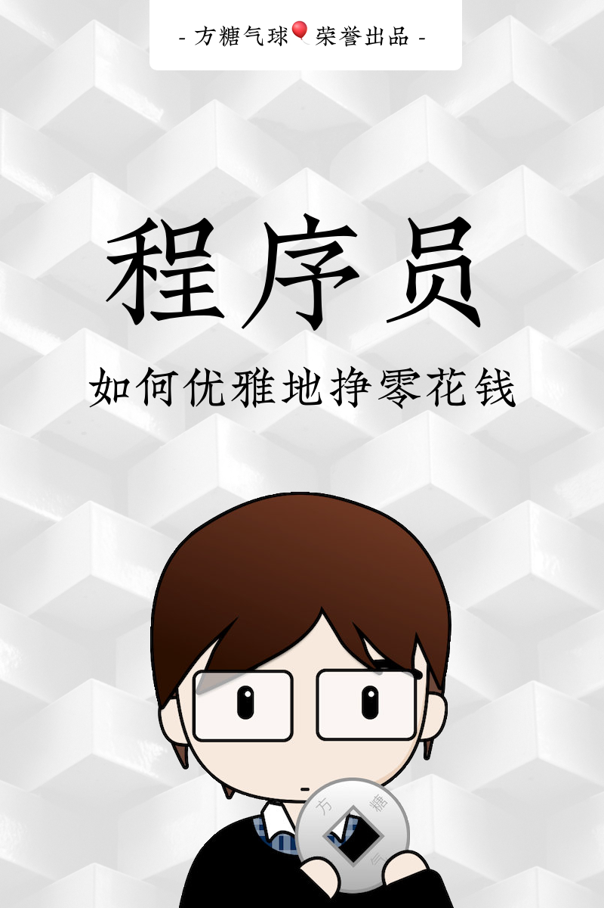

# 程序员如何优雅的挣零花钱？

the repo is not applicable to foreigners

## 阅读建议

🎈 [《一人企业方法论2.0》已在CC-BY-NC-SA协议下发布，建议先读完后继续阅读本书](https://github.com/easychen/one-person-businesses-methodology-v2.0) 

---

> 本书部分内容已被收录于《全栈路线图》，[可点此查看高清版PDF和源文件](https://github.com/easychen/stack-roadmap)

本系列文章会持续更新，微信扫码订阅主题，可第一时间获取更新信息。

新增：网课制作思维导图 [高清PDF下载](https://share.weiyun.com/78SWCYli) [视频课程](http://next.ftqq.com/18)

- 关注作者：
  - 微博(主要为技术分享):[@Easy](https://weibo.com/easy) 
  - Twitter（主要转发妹子和猫）：[Easychen](https://twitter.com/easychen/)
- 源文件：[GitHub Repo](https://github.com/easychen/howto-make-more-money/)
- 免费在线阅读完整版：[github.io镜像](https://easychen.github.io/howto-make-more-money/) [vercel镜像](https://howto-make-more-money.easychen.vercel.app/)
- 高清思维导图和PDF电子书下载：关注微信公众号「不聊技术」(nonocode)，发送「零花钱」获取下载链接。

如果你觉得这本小书对你有所帮助的话，请分享给身边的程序员，谢谢。

## 更新日志
- 2020/10/17：新增网课制作思维导图
- 2020/08/27：修正资产评分标准，更新网易云课堂分成比例的信息。
- 2020/04/07：全面重写为一本小书。
